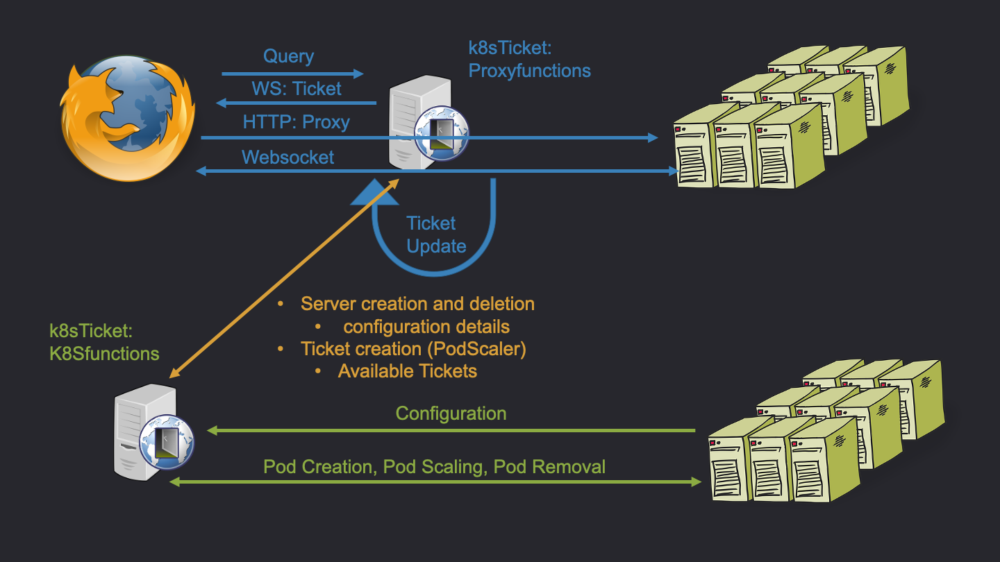

# Documentation
## General Introduction
k8sTicket is a reverse proxy with a built-in Kubernetes controller. It is designed for user-based deployment and scaling of applications in Kubernetes. Kubernetes offers the horizontal Pod auto-scaler (HPA) to scale applications based on different metrics (e.g. memory usage). At the moment the horizontal pod auto-scaler does not perform well when using stateful applications:

- interactive data analysis software often leads to unpredictable load based on the user's calculations and actions
	- scaling based on resources like memory or CPU usage is not effective in this situation
	- the quality of service can be influenced by calculations of other users
 	- running sessions are downscaled instead of idle ones
- you can not ensure how users are distributed across the several Pods in your cluster
	- the number of users can not be limited directly
	- error messages can be hard to interpret by the user
	- sometimes it is necessary to isolate the users
	- exclusive use of resources can not be guaranteed

k8sTicket tries to overcome those limitations by implementing an almost invisible ticket queue system for the users. Each user will use one exclusive slot on a Pod.
## Technical Details
k8sTicket has two main components: A reverse proxy based on Gorilla web toolkit and the Kubernetes custom controller based on the client-go library.
k8sTicket can only handle stateful web applications with continuous server-client-communication like WebSocket- or XHR-applications. It was tested successfully with R-Shiny applications.



### How does it work?
When being started, k8sTicket will configure itself by reading Kubernetes metadata annotations and labels. It will recognize Deployments that should be used and register the associated Pods. Afterwards, it will calculate the number of available tickets. When a client connects to the service, a WebSocket connection to the k8sTicket server will be established by Javascript. The server handles the query and checks for available resources. If there are free resources left, a new ticket will be made out and transferred to the client (as a session cookie). Then the client will be redirected to an address proxying the service of the Pod. Whenever a new ticket is created, k8sTicket checks if there are still enough spare tickets for new connections. When there are not enough tickets left, new Pods are scaled in Kubernetes. Those Pods will be removed when they are idle. A ticket will be marked as active as long as there is an established HTTP connection (or HTTP connections in short intervals).

### Configuration
k8sTicket can serve services of one or more Deployments. Please note that a different port must be used for each service. k8sTicket is limited to the namespace it is operating in. Examples are provided in [this folder](../examples/). k8sTicket can be easily used with your existing Deployments without much reconfiguration. Because k8sTicket will proxy your applications, you do not need to configure ingress definitions for them anymore.

**How to configure k8sTicket?**

k8sTicket retrieves its configuration directly from the metadata definitions of the target Deployment(s).

The following Labels and Annotations can be used in your definitions:

#### Labels:
##### Deployment:

`k8sTicket: "true"`

Enables k8sTicket for this Deployment
Setting it to any other value than "true" will stop k8sTicket on this service gracefully.
This means existing connections will be served until the user quits; new connections are not accepted anymore
Warning: If Pods that were scaled by k8sTicket, are still exisitng, you have to remove them by yourself.

##### Pods (PodTemplate of the Deployment):

`ipb-halle.de/k8sticket.deployment.app: name_of_your_service`

This label is needed by k8sTicket to recognize which Pods belong to which applications. It must be set to the same value as in the annotation `ipb-halle.de/k8sticket.deployment.app` at the deployment (following).


#### Annotations:

##### Deployments:

`ipb-halle.de/k8sticket.deployment.app: name_of_your_service`

Must be the same value as in the label set in the PodTemplate. This name must be unique in the namespace.
k8sTicket will use this name as the path to provide your application in the proxy component.

`ipb-halle.de/k8sticket.deployment.maxPods: "1"`

The number of Pods that k8sTicket is allowed to scale in this namespace.
Default: "1"

`ipb-halle.de/k8sticket.deployment.maxTickets: "1"`

The maximal number of tickets (users) for each Pod.

`ipb-halle.de/k8sticket.deployment.port: "9001"`

The port of k8sTicket which will be used to serve your application. Must be unique for each k8sTicket instance in a namespace.
Default: "1"

`ipb-halle.de/k8sticket.deployment.Podcooldown: "10"`

The time in seconds until an unused Pod will be downscaled by k8sTicket. Please note that this will also modify the interval of activity checks. That means in practice an interval of 10 seconds will lead to Pod removal between 10 and 20 seconds.
Default: "10"

`ipb-halle.de/k8sticket.deployment.spareTickets: "2"`

The number of tickets that are scaled for additional users in advance. k8sTicket will scale as many Pods as needed for this number of unoccupied tickets until `ipb-halle.de/k8sticket.deployment.maxPods` is reached. This option is notably useful if your Pods need a long time for getting available.

##### Pods (PodTemplate of the Deployment):

`ipb-halle.de/k8sTicket.port: "80"`

The port serving your application in the Pod.
Default: "80"

`ipb-halle.de/k8sTicket.path`

The HTTP path of your application in the Pod. k8sTicket will rewrite the requests to this path.
Default: "/"

## Metric

k8sTicket has a metric endpoint for [Prometheus](https://prometheus.io/). Currently it is running at 9999/metrics, but the port of this endpoint will be changed in the future.
The following metrics are exported:

##### Gauges

`k8sticket_current_users_total`

The total number of current users.

`k8sticket_current_free_tickets_total`

The number of slots than can be used for client connections (unoccupied tickets).

`k8sticket_scaled_pods_total`

The number of pods scaled by k8sTicket.

##### Counters

`k8sticket_users_total`

The total number of users served (total number of made out tickets).


## Questions
**Can I add another Deployment or single Pods to an existing Deployment that is already handled by k8sTicket?**

Yes, you just need to add the described Labels and Annotations to the PodSpec. In that way, you can deploy different versions of your application.

**How to modify the path (application name) of a running deployment?**

Without downtime:

You have the option to copy your existing deployment and modify the specified Labels and Annotations (please note that you must modify the port). k8sTicket will then serve this application additionally. Configure the new path and port as ingress specification. Remove "true" in the ```k8sTicket``` metadata Label in your old Deployment definition. k8sTicket will still serve the existing connections, but will not allow new connections at the old endpoint. When there are no clients left at the old Deployment, you can remove the Deployment entirely.

With downtime:

When downtime is tolerable, you can remove "true" at the ```k8sTicket``` metadata Label, wait until all your clients disconnect and change the values of the Annotation and Label `ipb-halle.de/k8sticket.deployment.app`. Please note, that renaming the Label for the Pods will cause Kubernetes to replace all running Pods.